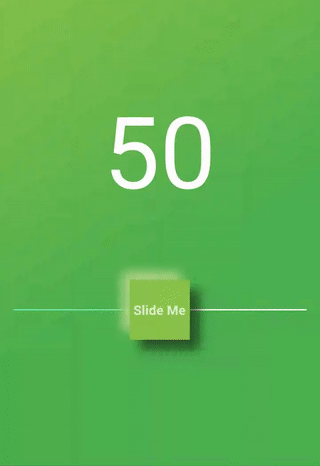
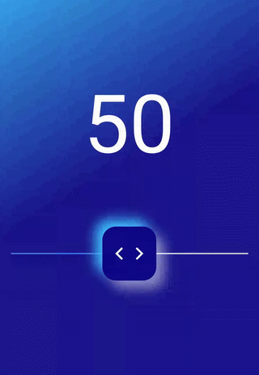
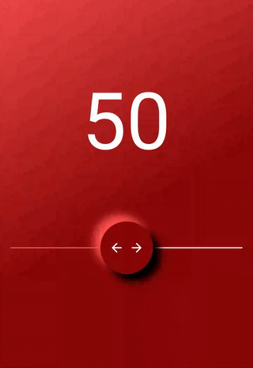

# Awesome - Slider

MIGRATED TO NULL SAFETY

A highly customisable Rounded Rectangular thumb shaped slider for flutter projects which has shadow and child property.

 


## Getting Started

- [Installation](#installation)
- [Basic Usage](#basic-usage)
- [Example Demo](#example-demo)
- [Awesome Slider parameters](#awesome-slider-parameters)


### Installation

Add

```bash
awesome_slider : ^0.1.0
```
to your pubspec.yaml, and run


```bash
flutter packages get
```
in your project's root directory.

### Basic Usage

Import it to your project file

```dart
import 'package:awesome_slider/awesome_slider.dart';
```
and use Widget

```dart
AwesomeSlider()
```


### Example Demo


<details>
  <summary>Code example (click to expand)</summary>

```dart
import 'package:flutter/material.dart';
import 'package:awesome_slider/awesome_slider.dart';

void main() => runApp(MainApp());

class MainApp extends StatefulWidget {
  @override
  _MainAppState createState() => _MainAppState();
}

class _MainAppState extends State<MainApp> {
  double valueOnTextWidget = 0.0;
  @override
  Widget build(BuildContext context) {
    return MaterialApp(
      home: Scaffold(
        body: Container(
          decoration: BoxDecoration(
            gradient: LinearGradient(
              colors: [Colors.lightGreen, Colors.green],
              begin: Alignment.topLeft,
              end: Alignment.bottomRight,
              stops: [0.0, 0.6],
            ),
          ),
          child: Column(
            children: <Widget>[
              SizedBox(
                height: 250.0,
              ),
              Text(
                valueOnTextWidget.round().toString(),
                style: TextStyle(color: Colors.white, fontSize: 150.0),
              ),
              SizedBox(
                height: 80.0,
              ),
              AwesomeSlider(
                value: valueOnTextWidget,
                min: 0.0,
                max: 100.0,
                thumbColor: Colors.lightGreen,
                roundedRectangleThumbRadius: 0.0,
                topLeftShadow: true,
                topLeftShadowColor: Colors.lightGreen.shade300,
                topLeftShadowBlur: MaskFilter.blur(BlurStyle.normal, 8.0),
                bottomRightShadow: true,
                bottomRightShadowColor: Colors.black.withOpacity(0.5),
                bottomRightShadowBlur: MaskFilter.blur(BlurStyle.normal, 7.0),
                activeLineStroke: 2.0,
                activeLineColor: Colors.greenAccent,
                inactiveLineColor: Colors.white,
                child: Center(
                    child: Text(
                  'Slide Me',
                  style: TextStyle(
                    color: Colors.white.withOpacity(0.7),
                    fontSize: 20.0,
                    fontWeight: FontWeight.bold,
                  ),
                )),
                onChanged: (double value) {
                  setState(() {
                    valueOnTextWidget = value;
                  });
                },
              ),
            ],
          ),
        ),
      ),
    );
  }
}

```
</details>


<details>
  <summary>Code example (click to expand)</summary>

```dart
import 'package:flutter/material.dart';
import 'package:awesome_slider/awesome_slider.dart';

void main() => runApp(MainApp());

class MainApp extends StatefulWidget {
  @override
  _MainAppState createState() => _MainAppState();
}

class _MainAppState extends State<MainApp> {
  double valueOnTextWidget = 0.0;
  @override
  Widget build(BuildContext context) {
    return MaterialApp(
      home: Scaffold(
        body: Container(
          decoration: BoxDecoration(
            gradient: LinearGradient(
              colors: [
                Colors.lightBlueAccent,
                Color(0xFF100887).withOpacity(0.95)
              ],
              begin: Alignment.topLeft,
              end: Alignment.bottomRight,
              stops: [0.0, 0.5],
            ),
          ),
          child: Column(
            children: <Widget>[
              SizedBox(
                height: 250.0,
              ),
              Text(
                valueOnTextWidget.round().toString(),
                style: TextStyle(color: Colors.white, fontSize: 150.0),
              ),
              SizedBox(
                height: 80.0,
              ),
              AwesomeSlider(
                value: valueOnTextWidget,
                min: 0.0,
                max: 100.0,
                thumbColor: Color(0xFF100887),
                roundedRectangleThumbRadius: 25.0,
                thumbSize: 100.0,
                topLeftShadow: true,
                topLeftShadowColor: Colors.lightBlueAccent,
                topLeftShadowBlur: MaskFilter.blur(BlurStyle.normal, 11.0),
                bottomRightShadow: true,
                bottomRightShadowColor: Colors.white.withOpacity(0.5),
                bottomRightShadowBlur: MaskFilter.blur(BlurStyle.normal, 11.0),
                activeLineStroke: 2.0,
                activeLineColor: Colors.blueAccent,
                inactiveLineColor: Colors.white,
                child: Row(
                  mainAxisAlignment: MainAxisAlignment.center,
                  children: <Widget>[
                    Icon(
                      Icons.arrow_back_ios,
                      color: Colors.white,
                      size: 28.0,
                    ),
                    SizedBox(width: 10.0),
                    Icon(
                      Icons.arrow_forward_ios,
                      color: Colors.white,
                      size: 28.0,
                    )
                  ],
                ),
                onChanged: (double value) {
                  setState(() {
                    valueOnTextWidget = value;
                  });
                },
              ),
            ],
          ),
        ),
      ),
    );
  }
}

```
</details>


<details>
  <summary>Code example (click to expand)</summary>

```dart
import 'package:flutter/material.dart';
import 'package:awesome_slider/awesome_slider.dart';

void main() => runApp(MainApp());

class MainApp extends StatefulWidget {
  @override
  _MainAppState createState() => _MainAppState();
}

class _MainAppState extends State<MainApp> {
  double valueOnTextWidget = 0.0;
  @override
  Widget build(BuildContext context) {
    return MaterialApp(
      home: Scaffold(
        body: Container(
          decoration: BoxDecoration(
            gradient: LinearGradient(
              colors: [Colors.redAccent.shade200, Color(0xFF890808)],
              begin: Alignment.topLeft,
              end: Alignment.bottomRight,
              stops: [0.0, 0.6],
            ),
          ),
          child: Column(
            children: <Widget>[
              SizedBox(
                height: 250.0,
              ),
              Text(
                valueOnTextWidget.round().toString(),
                style: TextStyle(color: Colors.white, fontSize: 150.0),
              ),
              SizedBox(
                height: 80.0,
              ),
              AwesomeSlider(
                value: valueOnTextWidget,
                min: 0.0,
                max: 100.0,
                thumbColor: Color(0xFF890808),
                roundedRectangleThumbRadius: 80.0,
                thumbSize: 100.0,
                topLeftShadow: true,
                topLeftShadowColor: Colors.redAccent,
                topLeftShadowBlur: MaskFilter.blur(BlurStyle.normal, 8.0),
                bottomRightShadow: true,
                bottomRightShadowColor: Colors.black,
                bottomRightShadowBlur: MaskFilter.blur(BlurStyle.normal, 7.0),
                activeLineStroke: 2.0,
                activeLineColor: Colors.redAccent,
                inactiveLineColor: Colors.white,
                child: Row(
                  mainAxisAlignment: MainAxisAlignment.center,
                  children: <Widget>[
                    Icon(
                      Icons.arrow_back,
                      color: Colors.white,
                      size: 28.0,
                    ),
                    SizedBox(width: 10.0),
                    Icon(
                      Icons.arrow_forward,
                      color: Colors.white,
                      size: 28.0,
                    )
                  ],
                ),
                onChanged: (double value) {
                  setState(() {
                    valueOnTextWidget = value;
                  });
                },
              ),
            ],
          ),
        ),
      ),
    );
  }
}
```
</details>


### Awesome Slider Parameters

| Parameter                 |                       Default                       | Description                                                                                                             |
| :------------------------ | :-------------------------------------------------: | :---------------------------------------------------------------------------------------------------------------------- |
| **value** *double*                   |                   @required                         | Value of the Slider Position                                              |
|                                      |                                                     | (**value**!=null)                                                         |
|                                      |                                                     |(**value** >= **min** && **value** <= **max**)                             |
|                                      |                                                     |                                                                           |
| **min** *double*                     |                   @required                         | minimum value for the Slider                                              |
|                                      |                                                     | (**min** !=null)                                                          |
|                                      |                                                     |(**min** <= **max**)                                                       |
|                                      |                                                     |                                                                           |
| **max** *double*                     |                   @required                         | maximum value for the Slider                                              |
|                                      |                                                     | (**max** != null)                                                         |
|                                      |                                                     |                                                                           |
| **onChanged** *ValueChanged **double*** |                                                  |    Called when the user starts selecting a new **value** for the slider.  |
|                                      |                                                     | Parameter for the **onChanged** must be a double                          |
|                                      |                                                     |                                                                           |
| **child** *widget*                   |                                                     | Provide a child Widget to the Slider Thumb.                               |
|                                      |                                                     |                                                                           |
| **sliderWidth** *double*             |Default width will be the Canvas Width with a difference of 40px| The Width of the Slider.                                       |
|                                      |                                                     |                                                                           |
| **thumbSize** *double*               |Default value will be a 90px ratio of the original Canvas it was created| Size of the thumb                                      |
|                                      |                                                     |                                                                           |
| **thumbColor** *Color*               |               Colors.grey                           | Colour of the thumb                                                       |
|                                      |                                                     |                                                                           |
| **roundedRectangleThumbRadius** *double*|                   0.0                            | Radius of Rounded Rectangle                                               |
|                                      |                                                     | more the radius, The square thumb turns to a Circle                        |
|                                      |                                                     |                                                                           |
| **inactiveLineColor** *Color*        |                Colors.blue                          | The color for the inactive portion of the slider track.                   |
|                                      |                                                     |                                                                           |
| **inactiveLineStroke** *double*      |                      4.0                            | The stroke value for the inactive portion of the slider track.            |
|                                      |                                                     | Value for **inactiveLineStroke** = **activeLineStroke** unless given different values for both|
|                                      |                                                     |                                                                           |
| **activeLineColor** *Color*          |                Colors.blue                          | The color for the active portion of the slider track.                     |
|                                      |                                                     |                                                                           |
| **activeLineStroke** *double*        |                      4.0                            | The stroke value for the active portion of the slider track.            |
|                                      |                                                     | Value for **activeLineStroke** = **inactiveLineStroke** unless given different values for both|
|                                      |                                                     |                                                                           |
| **topLeftShadow** *bool*             |                    false                            | Give true value if a Shadow required on Top - Left of the thumb           |
|                                      |                                                     |                                                                           |
| **topLeftShadowColor** *Color*       |                    Colors.blueGrey                  | Colour of shadow of Top - Left of the thumb                               |
|                                      |                                                     |                                                                           |
| **topLeftShadowBlur** *MaskFilter*   |       MaskFilter.blur(BlurStyle.normal, 3.0)        | MaskFilter blur value for shadow of Top - Left of the thumb               |
|                                      |                                                     |                                                                           |
| **bottomRightShadow** *bool*         |                    false                            | Give true value if a Shadow required on Bottom - Right of the thumb       |
|                                      |                                                     |                                                                           |
| **bottomRightShadowColor** *Color*   |                    Colors.blueGrey                  | Colour of shadow of Bottom - Right of the thumb                           |
|                                      |                                                     |                                                                           |
| **bottomRightShadowBlur** *MaskFilter*|       MaskFilter.blur(BlurStyle.normal, 3.0)       | MaskFilter blur value for shadow of Bottom - Right of the thumb           |


